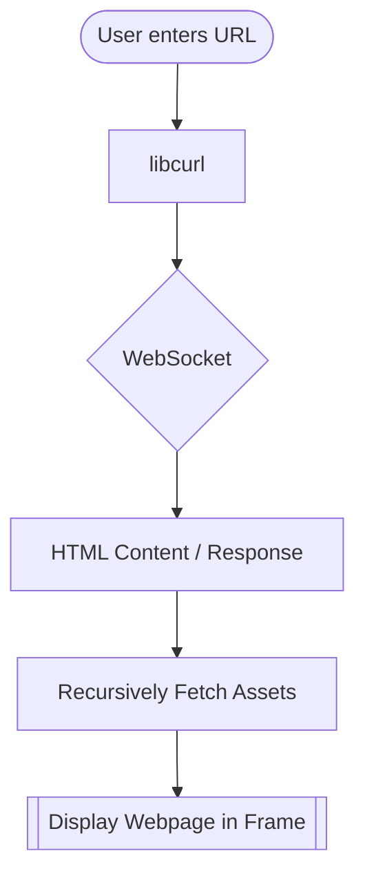

# What is this?
What you're looking at is GUST (the flagship proxy of Nautilus Labs), a unique entry in the web proxy ecosystem. It offers everything you want in a web proxy, stylized into a clean, familiar browser-like layout, plus things that no other current web proxy can deliver (we checked).

# Features
Designed with care by the Nautilus Labs team, GUST provides a suite of lovingly crafted features not often found in your typical run-of-the-mill web proxy. It includes tabs, bookmarks, favorites, a built-in adblocker, a homebrewed browser log system, a homebrewed inspect element system, a homebrewed file viewer, history tracking, metrics, an extensive list of settings allowing you to customize GUST to your liking, and more.

## How it Works
But aside from this extensive list of features, GUST's most powerful asset is its censorship-resistant nature. Traditional web proxies are fundamentally limited by their reliance on Service Workers. In all modern browsers, Service Workers are enforced with strict security requirements: they require a secure (HTTPS) origin, a specific directory structure to register, and they cannot be initialized from a local file. This means a standard proxy cannot run if you simply download it or open it as a local HTML file, making these proxies reliant on a live link which is blockable by any and all web filtering extensions. Service Workers are also often the first point of failure in restricted environments like admin controlled devices. They are easily blocked by administrative web filters and can be killed by the browser to save memory, instantly breaking the proxy tunnel and disconnecting your session. GUST, however, does not use serviceworkers at all, meaning GUST can run as a standalone HTML file. Because it doesn't need to register a background worker script to function, you can download the source, open the index.html file locally, or host it on any basic static provider (like GitHub Pages or Vercel) without any configuration at all. This makes it incredibly easy to share and incredibly hard to block, ensuring your free access to the web remains unshakeable.

## More in-depth

## Credits

| name | contribution |
|------ | ---------------- |
| lanefiedler | built the framework for the proxy
| dinguschan | designed the browser interface and added various features
x8rr | bug fixing and feedback, some assistance
